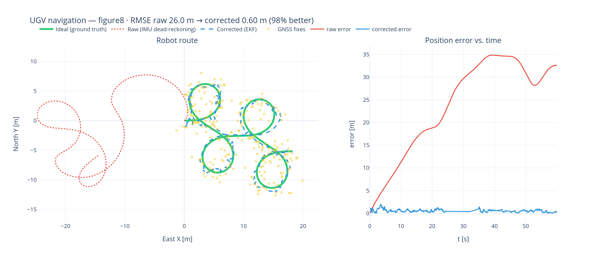
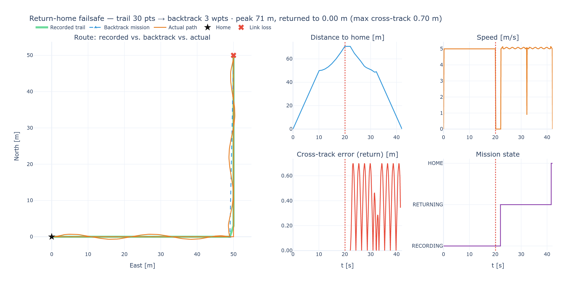

# UGV GNSS/INS Navigation Stand

A reproducible software stand for **modelling, researching and visualising odometry
and navigation of a ground robotic complex (UGV)**. It simulates a differential-drive
robot in **Gazebo Harmonic**, streams IMU / GNSS / wheel-odometry, fuses them with a
**15-state Error-State Kalman Filter (ESKF)** written in **C++23 with named modules**,
compares against a **`robot_localization`** baseline and **ground truth**, computes
navigation metrics automatically and renders them in a **Plotly/Dash dashboard**.

> Machine Learning is intentionally out of scope for this first stage.

---

## Highlights

- **Modern C++ core** (`ugv_nav_core`): C++23 **named modules** (`ugv.nav.core` with
  `:types`, `:math`, `:sensors`, `:eskf`, `:metrics` partitions), concepts, ranges,
  `std::span`, `std::numbers`, RAII/OOP — compiled with **Clang 19 + Ninja**.
- **GoogleTest** suite (26 cases) covering SO(3)/quaternion algebra, WGS-84 geodesy,
  wheel odometry, the ESKF (IMU propagation + GNSS/wheel updates, covariance PSD) and
  the metrics (RMSE/ATE/RPE/drift).
- **ROS 2 Jazzy** packages for simulation, sensor fault injection, estimation,
  baseline, metrics and dashboards.
- **Deterministic experiment matrix** (E01–E12) with one-command runs and
  self-contained result folders (config + rosbag + CSV + metrics + plots).
- **Fully containerised** dev environment (Dockerfile + Dev Container + Compose) that
  builds under both the classic Docker builder and BuildKit.

---

## Repository layout

```
.
├── .devcontainer/           # VS Code Dev Container (devcontainer.json, post-create.sh)
├── Dockerfile               # ROS 2 Jazzy + Gazebo Harmonic + Clang 19 + CMake/Ninja
├── docker-compose.yml       # headless build/run without VS Code
├── docker/entrypoint.sh     # sources ROS + overlay + venv
├── CMakePresets.json        # clang-modules / ros / asan presets
├── requirements.txt         # Dash/Plotly/pandas/... (Python analysis)
├── scripts/                 # build.sh, run_experiment.sh, run_all_experiments.sh, dashboard.sh, sim_dashboard.sh, run_sitl_failsafe.sh, rth_report.sh, reproduce_kfgins.sh
├── experiments/
│   ├── configs/             # E01..E12 scenario definitions
│   ├── run_experiment.py    # automated runner (launch → record → metrics → plots)
│   └── results/             # generated, git-ignored
├── third_party/KF-GINS/     # reference implementation (cloned on demand)
└── ros2_ws/src/
    ├── ugv_nav_core/        # C++23 module library + GoogleTest  (the algorithmic core)
    ├── ugv_description/     # differential-drive URDF/xacro + IMU/GNSS sensors
    ├── ugv_gazebo/          # Harmonic world + ros_gz bridge + launch
    ├── ugv_sensor_processing/  # wheel-joint → twist (reuses the core)
    ├── ugv_fault_injector/  # deterministic noise/bias/outage/slip injection
    ├── ugv_localization/    # online ESKF node (uses the core)
    ├── ugv_metrics/         # RMSE/ATE/RPE node (uses the core)
    ├── ugv_bringup/         # route commander + baseline + top-level launch
    ├── ugv_dashboard/       # Plotly/Dash apps: results viewer + interactive GNSS/IMU simulator
    └── ugv_return_home/     # C++23 module: return-home-on-link-loss failsafe (MAVLink/ArduPilot)
```

## Data flow

```
Gazebo Harmonic ──(ros_gz bridge)──► /imu/data /gps/fix /wheel/odometry /ground_truth/odom
                                            │
                                 ugv_fault_injector  (noise/bias/outage/slip, seeded)
                                            │
                                     /sensors/{imu,gnss,wheel_odom}
                                       │                 │
                              ugv_localization      robot_localization (baseline)
                                (ESKF, C++23)          /odometry/filtered
                                       │
                              /localization/{odom,path}
                                       │
                          ugv_metrics ──► data.csv + metrics.json ──► ugv_dashboard
                    (aligns vs /ground_truth/odom, RMSE/ATE/RPE/drift)
```

---

## Quick start

### 1. Open in the Dev Container (recommended)

Open the folder in VS Code → **“Reopen in Container”**. The image provides ROS 2 Jazzy,
Gazebo Harmonic, Clang 19, CMake (Kitware), Ninja, GoogleTest and the Python venv.
GUI apps (Gazebo/RViz) use X11; on NVIDIA add `--gpus=all` (see `.devcontainer/devcontainer.json`).

### 2. Or build/run headless with Compose

```bash
docker compose build           # builds ugv-nav-stand:jazzy-harmonic
docker compose run --rm dev     # interactive shell inside the container
```

### 3. Build the workspace

```bash
./scripts/build.sh              # colcon build with Clang + Ninja + C++23
source ros2_ws/install/setup.bash
```

### 4. Run the unit tests

```bash
cd ros2_ws
colcon test --packages-select ugv_nav_core --event-handlers console_direct+
colcon test-result --verbose
```

### 5. Run an experiment (Definition of Done)

```bash
./scripts/run_experiment.sh configs/E05_gnss_outage_30s.yaml
# → experiments/results/E05_gnss_outage_30s_<timestamp>/
#     ├── config.yaml  metadata.json  fault_injector.yaml
#     ├── data.csv  metrics.json
#     ├── trajectory.png  position_error.png  velocity_error.png  yaml_error.png
#     └── bag/            (rosbag2)
```

Run the full matrix:

```bash
./scripts/run_all_experiments.sh
```

### 6. Open the dashboard

```bash
./scripts/dashboard.sh                 # newest result under experiments/results/
# or a specific run:
./scripts/dashboard.sh experiments/results/E05_gnss_outage_30s_20260101_120000
# → http://localhost:8050  (auto-refreshes, so it also works live during a run)
```

### 7. Interactive GNSS/IMU simulator (no ROS/Gazebo needed)

A standalone Dash app that simulates the robot driving a chosen route, synthesises
noisy **IMU + GNSS** data on the fly and animates three trajectories side by side —
the **ideal** (ground truth), the **raw** IMU dead-reckoning (drifts) and the
**EKF-corrected** fusion (the algorithm) — plus live error/heading/speed/uncertainty
infographics. Every noise, bias, GNSS-rate and outage knob updates the plots instantly.

```bash
./scripts/sim_dashboard.sh             # → http://localhost:8051  (Play to animate)
```



Render a static PNG (used above) without the server:

```bash
python -m ugv_dashboard.render_preview --out docs/sim_preview.png --trajectory figure8
```

The embedded EKF mirrors the C++ `ugv.nav.core` ESKF design (IMU predict + loosely
coupled GNSS position update) in a compact planar form, so it typically recovers
**>90 %** of the dead-reckoning error even through a GNSS outage.

### 8. Return-home-on-link-loss failsafe (`ugv_return_home`)

An onboard C++23 module for the vehicle's flight computer that **records the driven
route** and, when the **operator datalink drops**, autonomously **backtracks the
vehicle home** along the recorded trail by commanding an **ArduPilot** autopilot over
**MAVLink**. It receives the current position (MAVLink `GLOBAL_POSITION_INT`, i.e.
`mavros` `NavSatFix`) and uploads the reversed, Douglas-Peucker-simplified path as a
mission (`MISSION_COUNT` + `MISSION_ITEM_INT`) after switching mode (`SET_MODE`).

Built with the same principles as the core: a **C++23 named module** (`ugv.rth`) with
an **ABI-stable facade** (`ugv::rth::api`), a **MISRA-friendly** control path (bounded
static storage, no dynamic allocation, no exceptions, strong `enum class`, `noexcept`
queries), and **GoogleTest** coverage (22 tests).

```bash
# Standalone deterministic demo (no ROS/Gazebo): drive an L-route, drop the link,
# watch the autopilot backtrack home over a simulated MAVLink.
ros2 run ugv_return_home rth_demo

# ROS 2 node wired to mavros topics (position + operator heartbeat):
ros2 launch ugv_return_home rth.launch.py
ros2 topic pub -r 2 /operator/heartbeat std_msgs/msg/Empty {}   # heartbeat; stop it to trigger
ros2 service call /rth/force std_srvs/srv/Trigger {}             # or force a manual return

# Inside the full Gazebo stack (records /gps/fix, drops the link at t=30s) — the
# robot physically drives itself home when the link is lost:
ros2 launch ugv_bringup bringup.launch.py return_home:=true rviz:=true rth_drop_after:=30.0

# Hardware-in-the-loop against ArduPilot SITL + mavros (real MAVLink):
./scripts/run_sitl_failsafe.sh 25

# Route + metrics figure from the standalone demo (no ROS needed):
./scripts/rth_report.sh docs/rth_metrics.png
```

The `IAutopilotLink` interface is the MAVLink seam, with two interchangeable backends:

- **`RosBridgeLink`** (default) — mavros-agnostic: publishes the backtrack as a latched
  `nav_msgs/Path` (`/rth/return_path`, RViz-ready) and the commanded autopilot mode
  (`/rth/autopilot_mode`), and logs the exact MAVLink actions.
- **`MavrosLink`** (`use_mavros:=true`) — real MAVLink via mavros services
  (`SetMode`, `WaypointPush`, `WaypointClear`). Compiled automatically when
  `mavros_msgs` is present (the image installs it), enabling ArduPilot SITL/HIL.

**Closed-loop return in simulation.** `rth_node` also publishes the high-level mission
state (`/rth/mission_state`: `IDLE`/`RECORDING`/`RETURNING`/`HOME`) and the recorded
breadcrumb trail (`/rth/recorded_path`). A `return_follower` (pure-pursuit) subscribes
to the backtrack `nav_msgs/Path` and takes over `/cmd_vel` while `RETURNING`, so the
Gazebo vehicle actually drives back along its route; `trajectory_commander` yields the
moment the failsafe activates. RViz shows the recorded trail (green) and the backtrack
(blue) live.

**Route + metrics visualisation.** `rth_demo run.json` writes a run log that
`ugv_dashboard.rth_plots` turns into a route map (recorded vs. backtrack vs. actual
driven path) plus distance-to-home, speed, cross-track error, and the mission-state
timeline:



### 9. Reproduce the KF-GINS reference (milestone 1)

```bash
./scripts/reproduce_kfgins.sh          # clones, builds and runs the KF-GINS demo dataset
```

---

## Experiment matrix

| ID  | Scenario                              | Key fault |
|-----|---------------------------------------|-----------|
| E01 | Nominal                               | none |
| E02 | GNSS noise (low)                      | `gnss.noise_std=0.5` |
| E03 | GNSS noise (high)                     | `gnss.noise_std=2.5` |
| E04 | GNSS outage 10 s                      | outage @25 s |
| E05 | GNSS outage 30 s                      | outage @20 s |
| E06 | GNSS outage 60 s                      | dead-reckoning stress |
| E07 | IMU white noise                       | accel/gyro noise |
| E08 | IMU bias                              | constant accel/gyro bias |
| E09 | Wheel-odometry noise                  | `odometry.noise_std` |
| E10 | Wheel-odometry scale error            | `scale_factor=1.1` |
| E11 | Wheel slip (transient)                | slip window |
| E12 | GNSS outage + wheel slip (combined)   | compound failure |

Each config is a ROS 2 parameter file (`fault_injector_node`) plus an `experiment`
block (`id`, `seed`, `duration`, `baseline`). Runs are deterministic for a fixed `seed`.

---

## Metrics (`ugv_metrics` + `ugv.nav.core:metrics`)

- **Position RMSE** / **ATE** – RMS of ‖p_est − p_gt‖
- **RPE** – frame-to-frame relative pose error
- **Velocity RMSE**, **Yaw RMSE** (angle-wrapped)
- **Max error**, **travelled distance**, **relative drift %**

---

## Toolchain notes

- **C++ standard:** C++23 (`-std=c++23`), Clang 19, Ninja generator, CMake ≥ 3.28
  (`CMAKE_CXX_SCAN_FOR_MODULES=ON`).
- **Modules vs. ROS ABI:** ROS 2 debs are built against **libstdc++**, so ROS nodes use
  libstdc++ for ABI compatibility. The module core is embedded into a **shared facade
  library** (`ugv::nav::api`) with an ABI-stable, include-only header, so downstream
  colcon packages link it without importing modules across package boundaries.
- **Eigen + modules shim:** Clang 19 gives some Eigen inline free-operator
  instantiations module-internal linkage. `src/eigen_support.cpp` (built `-O0`) provides
  the out-of-line definitions — see the comment in that file.
- **Middleware:** `rmw_cyclonedds_cpp`.

## License

Reference dependency KF-GINS is GPL-3.0; this project is distributed under GPL-3.0-only.
